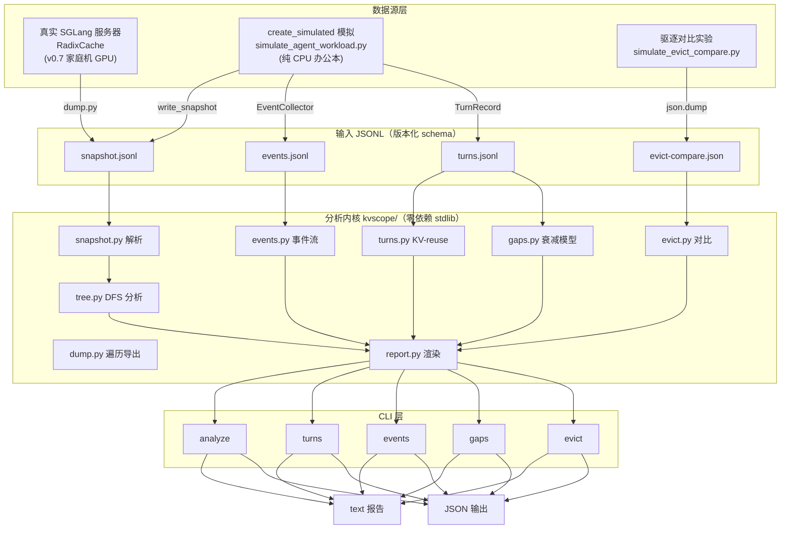
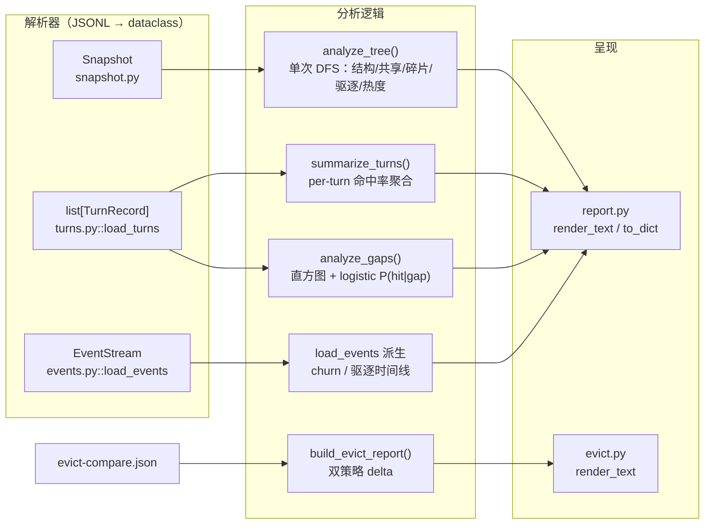
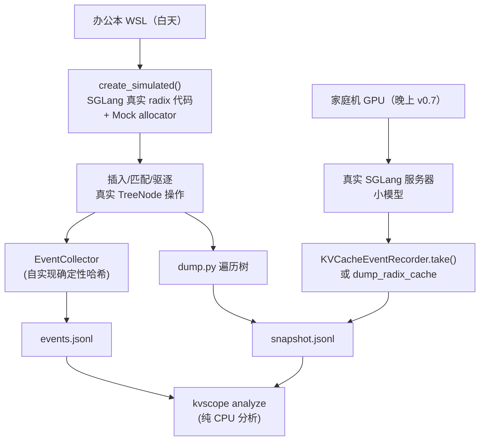
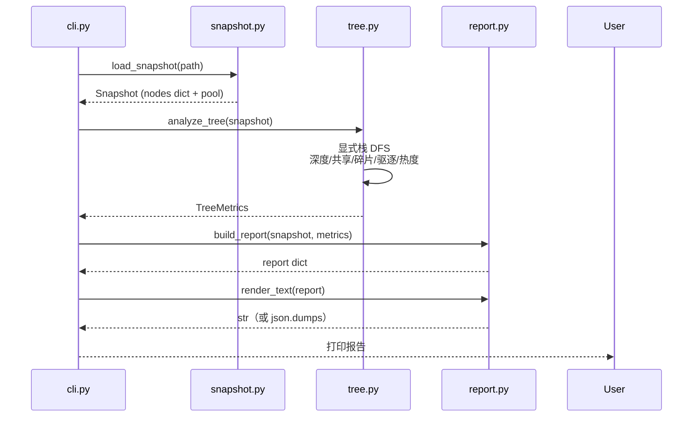

# SGLang KV Cache 分析器 — 数据模型设计文档

> 日期：2026-08-28 ｜ 状态：最终设计（v0.6 定稿）
> 项目定位：SGLang 的 "KV cache 显微镜"——离线分析 radix cache 结构/共享率/碎片/驱逐效率
> 参考蓝本：vLLM 官方离线 prefix-cache analyzer（PR #48369/#48838，未合并，我们模仿其模式但面向 SGLang）
> 版本演进：v0.1 快照 → v0.2 端到端 → v0.3 turns → v0.4 events → v0.5 gaps → v0.6 evict（见 RESEARCH.md）

## 一、为什么数据模型要基于 radix cache 而非 block hash

| 维度 | vLLM（参考实现） | SGLang（本项目） |
|---|---|---|
| 缓存粒度 | 固定 block（如 16 tokens），块哈希链 | **token 级 radix 树**，任意长度前缀共享 |
| 匹配机制 | `hash_block_tokens(hash_fn, parent, tokens)` 全块哈希匹配 | `RadixKey.match()` 指数搜索公共前缀，`page_size` 对齐 |
| 结构 | 扁平 trie（BlockHash 为 key） | 分层树：`TreeNode`（children/parent/key/value/lock_ref） |
| 关键操作 | 无分裂 | **`_split_node`**（部分匹配时分裂节点）——SGLang 独有的结构特征 |
| 驱逐 | 未建模（v1 范围外） | **eviction heap + evictable_leaves**（LRU/优先级）——真实驱逐行为 |

**结论**：模仿 vLLM 的"输入输出模式"（CLI + 报告 + 分组展示），但核心算法用 SGLang 自己的 radix 语义。

## 二、SGLang TreeNode 数据模型（真实结构，dump 的来源）

源码：`python/sglang/srt/mem_cache/radix_cache.py`（864 行，main 分支）

```
TreeNode
├── id: int                    # 全局递增节点 id
├── children: dict[child_key, TreeNode]   # RadixKey.child_key() 为 key
├── parent: TreeNode
├── key: RadixKey              # 本节点承载的 token 段（RadixKey: token_ids + extra_key + cache_salt + is_bigram + limit）
├── value: Tensor | None       # None = 已驱逐（evicted 属性）
├── lock_ref: int              # 引用锁（>0 不可驱逐）；root 恒为 1
├── host_ref_counter: int      # host 侧引用（backup 保护）
├── last_access_time: float    # 最近访问（LRU 依据）
├── creation_time: float
├── hit_count: int             # 命中计数（⚠️ 历史上出过"从未递增"bug #18843）
├── priority: int              # 优先级驱逐策略依据（root 为 -sys.maxsize）
├── hash_value: List[str]      # 每页哈希（外部事件用）
└── evicted: bool              # = (value is None)
```

**核心结构行为**：
- **部分匹配分裂**：`match_prefix`/`_insert_helper` 遇到 `prefix_len < len(child.key)` 时调用
  `_split_node(key, child, prefix_len)`——新节点继承 child 的 priority/hit_count/lock_ref，
  child 保留剩余部分。分裂是碎片化的直接来源。
- **驱逐**：`evict()` 用 `evictable_leaves` 集合 + heap（`eviction_strategy.get_priority(node)`），
  从叶子往上删，父节点空了并入堆。驱逐只发生在叶子。
- **命中**：`_inc_hit_count(node, chunked)`——chunked 请求跳过计数（防自引用膨胀）。
- **模拟入口**：`RadixCache.create_simulated(disable, mock_allocator, page_size)`——
  "without memory pools for simulation purpose"，**纯 CPU 可跑，正是我们初版的基础**。

## 三、dump 格式设计（JSONL，离线分析的数据源）

模式：**运行时快照 dump → 离线 CPU 分析**（解耦，白天无 GPU 可开发）。

### 3.1 快照 dump（从运行的 SGLang 导出）

```jsonl
{"type": "snapshot", "version": 1, "ts": 1756000000.123, "page_size": 1, "eviction_policy": "lru",
 "pool": {"total_tokens": 100000, "used_tokens": 62000, "evictable_tokens": 41000, "protected_tokens": 21000},
 "nodes": [
   {"id": 0, "parent": -1, "token_len": 0, "children": [1, 2], "lock_ref": 1, "hit_count": 0,
    "priority": -9223372036854775808, "evicted": false, "last_access": 0.0, "depth": 0},
   {"id": 1, "parent": 0, "token_len": 512, "children": [3], "lock_ref": 2, "hit_count": 14,
    "priority": 5, "evicted": false, "last_access": 1755999.8, "depth": 1},
   ...
 ]}
```

字段说明：
- `nodes` 为扁平数组，`parent`/`children` 用 id 引用（便于离线重建树）
- `token_len` = `len(node.key)`（token 数，不是字节）
- `evicted` = value is None；`depth` 由分析端计算（不信任运行时）
- **不导出 token_ids 本身**（隐私 + 体积），只导出结构。需要内容分析时可选 `"include_tokens": true`

### 3.2 请求级 trace（可选第二数据源，来自 --export-metrics-to-file-dir）

SGLang 已有 `RequestMetricsExporter`（`--export-metrics-to-file-dir` → JSONL），
每条含 `request_parameters` + `meta_info`（cached_tokens、queue_time、时间戳等）。
分析器可合并此数据做 per-request 视角。

## 四、分析维度（v1 范围）

从快照可计算：

| 维度 | 指标 | 公式/来源 |
|---|---|---|
| **结构** | 节点总数、深度分布、每层节点数 | DFS 重建树 |
| **共享率** | 共享节点 token 占比 | `sum(len(key) for nodes with >1 children) / total_tokens` |
| **碎片** | 分裂节点占比、平均 token_len 分布、短节点（<16 token）占比 | `_split_node` 产生大量短节点 → 碎片代理指标 |
| **驱逐效率** | evictable vs protected 比例、被驱逐节点深度 | pool 字段 + evicted 节点分布 |
| **命中热度** | hit_count 分布（长尾？）、高热度节点占比 | hit_count 字段 |
| **内存效率** | 实际复用 token 数 vs 理论最优（全部共享） | 复用率 = 1 - unique_token_len/total_token_len |

**输出报告**（模仿 vLLM 的 text/json 双格式）：

```
KV Cache Analysis Report
─────────────────────────
snapshot tokens      : 62000
unique tokens        : 31000
reuse ratio          : 50.0%
nodes                : 128 (depth 1..24, median 6)
split nodes          : 42 (32.8%)          ← 碎片指标
shared nodes         : 35 (27.3%)
evictable/protected  : 41K / 21K
hot nodes (hit>10)   : 8 (6.2%)  ← top hit: 14
```

## 五、与 vLLM 参考实现的映射（模仿什么、改什么）

| vLLM 组件 | 我们模仿 | 我们的改动 |
|---|---|---|
| `load_plain_prompt_jsonl` | ✅ JSONL 解析 + 校验 | 输入是**快照 JSONL** 而非 prompt JSONL |
| `_full_block_hash_chain` | ❌ 不模仿（SGLang 无块哈希） | 改为**快照树重建**（parent/children id 图 → 树） |
| `_TrieNode` / `_group_requests_by_shared_prefix` | ✅ trie 遍历 + top-K 分组思路 | 直接对快照树做 DFS，无需重建 trie |
| `_reusable_tokens_from_chains` | ✅ 防双重计数思想 | 改为"每个 TreeNode 只计一次" |
| `AnalysisReport`（dataclass + to_dict + render_text） | ✅ **完全模仿** | 字段换成 SGLang 指标 |
| CLI（`--model --input --block-size --output-format`） | ✅ **完全模仿** | `--input snapshot.jsonl --output-format {text,json}` |
| 单测（合成数据、不依赖 tokenizer） | ✅ **完全模仿** | 合成 TreeNode 快照测分组/计数/边角 |

## 六、架构（实际落地，v0.6）

```
kvscope/                          # 项目名（SGLang KV cache 显微镜）
├── kvscope/
│   ├── __init__.py
│   ├── cli.py                    # CLI 入口：analyze / turns / events / gaps / evict
│   ├── snapshot.py               # 快照 JSONL 解析 + 校验（utf-8-sig 容错）
│   ├── tree.py                   # 快照 → 树重建 + DFS 分析（单次遍历）
│   ├── report.py                 # 快照报告渲染（text/json）
│   ├── dump.py                   # 遍历 RadixCache → 快照 JSONL（duck-typed）
│   ├── turns.py                  # per-turn KV-reuse 分析（含 hit 长度算法）
│   ├── events.py                 # KV 事件流分析（churn/驱逐时间线）
│   ├── gaps.py                   # gap 衰减模型（logistic P(hit|gap)）
│   └── evict.py                  # 驱逐策略对比报告
├── scripts/
│   ├── simulate_agent_workload.py  # 多轮 agent 模拟 → snapshot+turns+events（需 sglang）
│   └── simulate_evict_compare.py   # 驱逐策略对比实验（需 sglang）
├── examples/                     # 真实 SGLang 产生的样例数据
├── tests/                        # 38 个合成数据单测（零依赖）
├── docs/                         # DESIGN / ADR / RESEARCH
├── pyproject.toml
└── README.md
```

## 七、风险与对策

| 风险 | 对策 |
|---|---|
| SGLang 内部 API 版本漂移 | dump 侧锁定 SGLang 版本；分析侧只依赖快照格式（版本化 schema） |
| 无 GPU 端到端验证 | v1 用 `create_simulated` + 合成快照，纯 CPU；真实 dump 等晚上 3080 |
| kvcachescope 抢认知 | 差异化定位：结构分析 vs 运维监控 |
| 快照格式可能被社区质疑 | 主动对齐 `KVCacheEventRecorder`（events.py）的既有事件模型 |

## 八、v0.3-v0.6 数据模型补充

### 8.1 turns（per-turn KV-reuse，v0.3）

```jsonl
{"turn": 1, "context_tokens": 544, "hit_length": 512, "new_tokens": 32,
 "hit_node_id": 1, "timestamp": 6.38, "gap_seconds": 6.38}
```

- `hit_length` 来源：`compute_hit_length_from_node(last_device_node)` =
  沿 parent 链累加 `token_len`（从 root 到匹配节点的路径总长）
- `timestamp`/`gap_seconds`（v0.5 起）：模拟时钟（`clock += gap`），
  注意 **SGLang 的 `node.last_access_time` 是真实 monotonic 时钟，不可比较**

### 8.2 events（KV 事件流，v0.4）

```jsonl
{"type": "stored",  "block_hashes": [4634487095784212721], "parent_block_hash": null,
 "num_tokens": 1, "medium": "GPU"}
{"type": "removed", "block_hashes": [1,2,3], "medium": "GPU"}
{"type": "cleared"}
```

- 结构对齐 SGLang `BlockStored`/`BlockRemoved`/`AllBlocksCleared`
- 哈希：纯 Python 确定性（sha256 截断）替代 HiCache native 扩展

### 8.3 gaps（gap 衰减模型，v0.5）

- 间隙直方图：`<10s / 10-60s / 1-5min / 5-30min / >30min`
- 衰减曲线：每桶的 next-turn hit ratio（实证：<10s 93%、5-30min 0%）
- logistic 模型：`P(hit|gap) = 1/(1+exp(-(a + b·ln(gap))))`，最小二乘拟合
- `cache_decay_probability(gap) = 1 - P(hit|gap)` = 预测性驱逐信号

### 8.4 evict（驱逐策略对比，v0.6）

```json
{"workload": {...}, "strategies": {
  "lru":        {"hit_ratio": 0.88, "eviction_rounds": 59},
  "predictive": {"hit_ratio": 0.88, "eviction_rounds": 42}}}
```

- 实验设计：相同请求序列 + 有限 KV 池 + 唯一差异 = "长间隙主动清理"
- 结果：同命中率下预测性驱逐 -29% 驱逐轮次（CacheWise 方向实证）

## 九、架构图（mermaid，渲染见 GUI 或任意 mermaid 渲染器）

### 9.1 总体分层架构



### 9.2 分析内核数据流（模块依赖）



### 9.3 两条运行时路径（办公本模拟 vs 家庭机真实）



### 9.4 一次 `kvscope analyze` 的调用链



### 9.5 架构要点速览

| 层 | 职责 | 关键约束 |
|----|------|---------|
| 数据源层 | 产生 snapshot/turns/events/evict 数据 | scripts/ 依赖 sglang；真实源（S1）v0.7 待打通 |
| 输入层 | 版本化 JSONL schema | version 字段；utf-8-sig 容错 |
| 分析内核 | 纯 stdlib 分析 | 零 SGLang 依赖（ADR-009）；单次 DFS（无二次方） |
| CLI 层 | 5 个子命令 | 模仿 vLLM CLISubcommand 模式 |
| 输出层 | text / json 双格式 | report dict 单一数据源 |
